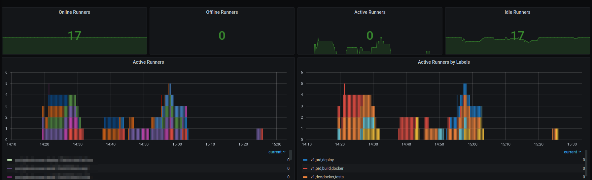

# Github org runner exporter

Prometheus metrics exporter for github actions self-hosted runners.


## Settings

| Variable             | Required | Description |
|----------------------|:--------:|----------------------------------------|
| PRIVATE_GITHUB_TOKEN | Yes      | Github token with read org permissions
| OWNER                | Yes      | Github organization name
| REFRESH_INTERVAL     | No       | Internval time in seconds betwen api requests (Default: 20)
| LOG_LEVEL            | No       | Log level: DEBUG, INFO, WARNING or ERROR (Default: INFO)


## Deploy with helm

Clone the repository:

```sh
git clone git@github.com:tchelovilar/github-org-runner-exporter.git
```

Update the values file [deploy/helm-chart/prometheus-org-runner-exporter/values.yaml](./deploy/helm-chart/prometheus-org-runner-exporter/values.yaml)
with environment settings described above.

Go to the project foldar and execute helm install command:

```sh
cd github-org-runner-exporter

helm install github-runner-exporter ./deploy/helm-chart/prometheus-org-runner-exporter/
```


## Grafana Dashboard

Import the grafana dashboard file [grafana/dashboard.json](./grafana/dashboard.json)


